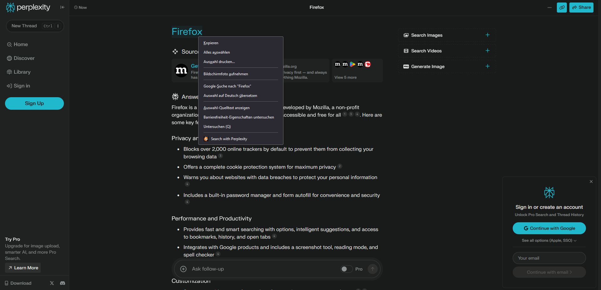

#  Perplexifox 

A Firefox extension to quickly search selected text or images with Perplexity AI directly from the context menu.

## Overview

Perplexifox is a simple and useful Firefox extension that allows you to search selected text or images directly via the context menu using Perplexity AI. It seamlessly integrates into your browsing experience, providing quick and accurate search results.

